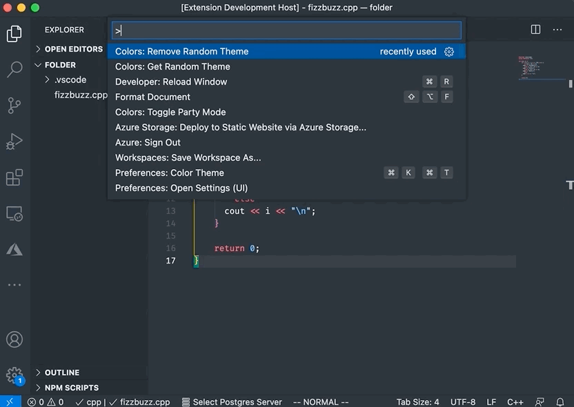
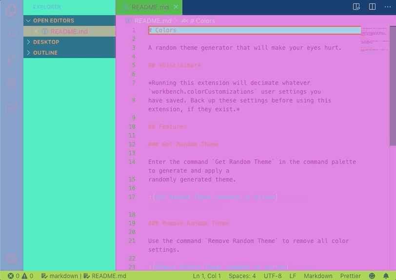

# Colors

A random theme generator for VS Code that will make your eyes hurt.

## Disclaimers
🛑 Warning: Rapidly flashing colors! 🛑

Running this extension will decimate whatever `workbench.colorCustomizations` user settings you
have saved. Back up these settings before using this extension, if they exist.

## Features

### Get Random Theme

Enter the command `Colors: Get Random Theme` in the command palette to generate and apply a
randomly generated theme.

### Remove Random Theme

Use the command `Colors: Remove Random Theme` to remove all color settings.

### Party Mode

You didn't ask for it yet here it is. Run the `Colors: Toggle Party Mode` command for some rapid changing color action.

And when you've had enough, run `Colors: Toggle Party Mode` again to stop the party.

